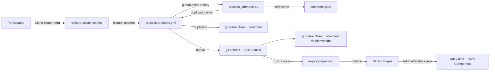

# DemoUNAP — GitHub Community & Tools Workshop

Este repositorio es el resultado práctico del **GitHub Community & Tools Workshop: Comunidad, colaboración y herramientas para desarrolladores**. El objetivo no es únicamente mostrar líneas de código, sino evidenciar en tiempo real el poder de la colaboración y del ecosistema de herramientas de GitHub.

Buscamos construir un espacio seguro e inclusivo donde cualquier estudiante pueda inspeccionar la arquitectura, entender el flujo de trabajo y dar sus primeros pasos contribuyendo a un repositorio real.

## ¿Cómo funciona?



### 1. Captura de datos (Issue Forms)

El registro se realiza a través de un Issue Form estricto ([`.github/ISSUE_TEMPLATE/registro-asistencia.yml`](.github/ISSUE_TEMPLATE/registro-asistencia.yml)) que elimina la posibilidad de errores de formato:

- **Selección única**: el campo de avatar es un `dropdown` restrictivo con solo tres opciones: `Mona`, `Copilot` o `Ducky`.
- **Autenticidad**: no se le pide al participante escribir su usuario de GitHub. El workflow toma esa responsabilidad directamente de `github.actor`.

### 2. Validación y procesamiento (GitHub Actions + Python)

Al enviar la Issue, el workflow [`.github/workflows/process-attendee.yml`](.github/workflows/process-attendee.yml) ejecuta [`scripts/process_attendee.py`](scripts/process_attendee.py) con las siguientes reglas de negocio:

- **Identidad verificada**: se usa `github.actor`, la variable nativa que identifica al usuario autenticado que creó la Issue.
- **Regla de unicidad (1 Issue por persona)**: el script lee [`attendees.json`](attendees.json) y verifica si `github.actor` ya existe. Si el usuario ya está registrado, la Issue se cierra automáticamente con un comentario indicándolo.
- **Actualización**: si el usuario es nuevo, el script formatea el registro (usuario, nombre a mostrar, tecnología y avatar), lo agrega al JSON y el workflow hace un commit automatizado a `main`. La Issue se cierra con un comentario de confirmación.

Las ejecuciones están serializadas con `concurrency` para evitar condiciones de carrera cuando llegan varios registros casi al mismo tiempo.

### 3. Frontend por componentes

Para que el despliegue en GitHub Pages sea rápido y consistente, la interfaz usa un patrón de componentes en HTML/CSS/JS vanilla:

- **Plantilla única (Card)**: un solo `<template>` ([`index.html`](index.html)) y un único componente ([`components/attendee-card/`](components/attendee-card)) definen el diseño, proporciones y animaciones de todas las tarjetas.
- **Renderizado dinámico**: [`js/main.js`](js/main.js) hace `fetch` a `attendees.json`, mapea la lista de participantes e inyecta las propiedades de cada uno (nombre, tecnología, avatar y enlace a su perfil de GitHub) en el componente de la card.
- **Escalabilidad**: al ser componentes, la página renderiza instantáneamente a decenas de participantes sin código repetitivo, manteniendo un peso ligero ideal para conexiones móviles.

### 4. Despliegue

[`.github/workflows/deploy-pages.yml`](.github/workflows/deploy-pages.yml) publica el sitio en GitHub Pages en cada push a `main`, por lo que cada nuevo registro republica automáticamente la página con la tarjeta actualizada.

> **Configuración requerida en el repositorio (una sola vez):**
>
> 1. En **Settings → Actions → General → Workflow permissions**, habilita **Read and write permissions** para que el workflow pueda comentar/cerrar Issues y hacer commit a `main`.
> 2. En **Settings → Pages**, selecciona **GitHub Actions** como fuente de despliegue.

## Solución de problemas

**Una Issue se creó pero el workflow aparece como "Skipped" en la pestaña Actions.**

Esto ocurre si la label `registro-asistencia` aún no existe como label del repositorio: GitHub **no crea labels automáticamente** a partir de un Issue Form, así que si la label no existía antes de recibir la primera Issue, esta no se le asigna y cualquier condición basada en esa label evalúa `false`. Por eso el workflow ya no depende de esa label para el evento `opened` (ver comentarios en [`process-attendee.yml`](.github/workflows/process-attendee.yml)).

Si de todas formas una Issue quedó sin procesar (por ejemplo, por una versión anterior de este workflow), puedes forzar su reprocesamiento agregándole manualmente la label `registro-asistencia` desde la UI de GitHub (se crea al vuelo si no existe): esto dispara el evento `labeled`, que el workflow también escucha.

## Estructura del proyecto

```
.
├── .github/
│   ├── ISSUE_TEMPLATE/
│   │   ├── registro-asistencia.yml   # Issue Form de registro
│   │   └── config.yml                # Desactiva issues en blanco
│   └── workflows/
│       ├── process-attendee.yml      # Validación, unicidad y commit automático
│       └── deploy-pages.yml          # Publicación en GitHub Pages
├── scripts/
│   └── process_attendee.py           # Lógica de negocio (Python, sin dependencias)
├── components/
│   └── attendee-card/                # Componente de tarjeta (CSS + JS)
├── styles/
│   ├── tokens.css                    # Variables de diseño
│   ├── reset.css                     # Reset base
│   └── layout.css                    # Layout general de la página
├── js/
│   └── main.js                       # Fetch + renderizado dinámico
├── img/
│   ├── avatars/                      # Mona, Copilot y Ducky
│   └── Fondo/                        # Fondo ilustrado del evento
├── attendees.json                    # Base de datos de asistentes
└── index.html
```

## ¿Cómo participar?

1. Abre una nueva Issue usando el [formulario de registro](../../issues/new?template=registro-asistencia.yml).
2. Completa tu nombre a mostrar, tu tecnología favorita y elige un avatar.
3. Envía la Issue: el workflow se encarga del resto y en minutos aparecerás en la página del evento.

¿Quieres ir más allá? Este repositorio es un excelente punto de partida para dar tus primeros pasos como contribuidor Open Source: revisa los workflows, propón mejoras al frontend o mejora la validación del script en un Pull Request.

## Licencia

Este proyecto se distribuye bajo los términos indicados en [LICENSE](LICENSE).
